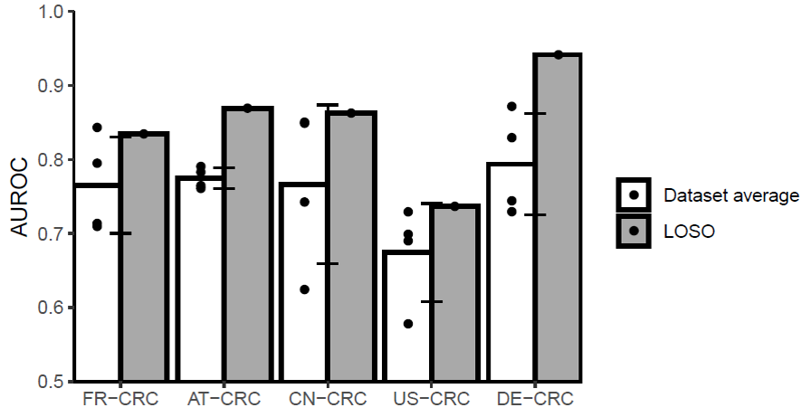

#  

# Work report_2019_7_18

### Reproduction of paper

This week I have reproduced the classification task of CRC and CTR in python ,the code is the classification.py.

This is the reproduced result of AUC value in paper(figure 1 and 2) and accuracyresult(table 1).

In figure 1 , the row is the traning set and the column is the testing set,and the value the AUC value in testing set.In table 1,the row is the training set and the column is the testing set,the value is accuracy  result.This sixth is the accuracy result of LOSO in testing set and the last row is the accuracy result of LOSO in training set . 

​                                                    									figure 1

​																	        figure  2

|                 | FR-CRC (test) | AT-CRC   | CN-CRC   | US-CRC   | DE-CRC   |
| --------------- | ------------- | -------- | -------- | -------- | -------- |
| FR-CRC  (train) | 0.742982      | 0.723853 | 0.737188 | 0.634712 | 0.715417 |
| AT-CRC          | 0.640175      | 0.813761 | 0.625859 | 0.542019 | 0.651833 |
| CN-CRC          | 0.692105      | 0.655963 | 0.75     | 0.592308 | 0.688333 |
| US-CRC          | 0.640702      | 0.677431 | 0.582188 | 0.653846 | 0.6255   |
| DE-CRC          | 0.712895      | 0.652936 | 0.722891 | 0.635577 | 0.7      |
| LOSO            | 0.733158      | 0.783486 | 0.774375 | 0.674038 | 0.795    |
| LOSO_CV         | 0.767896      | 0.761803 | 0.758389 | 0.798301 | 0.742857 |

​                                                                                    table 1

### feature selection

Then I try to remove some features that may disturb the generalization of classifier. The method is that I label the training set with 1 and label the testing set with -1 . Then I  train a RandomForest classifier to classify the training set and testing set and then remove some features with high feature importance.

I have tried to remove different ratio of features and then train the model to classify the CRC and CTR.

The result is below.

​							table 2  accuracy of removing 5% of the high feature importance 

|         | FR-CRC   | AT-CRC   | CN-CRC   | US-CRC   | DE-CRC   |
| ------- | -------- | -------- | -------- | -------- | -------- |
| FR-CRC  | 0.739474 | 0.725963 | 0.733984 | 0.646635 | 0.717917 |
| AT-CRC  | 0.647982 | 0.814679 | 0.663984 | 0.537019 | 0.651167 |
| CN-CRC  | 0.726754 | 0.659083 | 0.75     | 0.594519 | 0.745417 |
| US-CRC  | 0.625526 | 0.664404 | 0.589141 | 0.653846 | 0.656833 |
| DE-CRC  | 0.689561 | 0.621193 | 0.760547 | 0.631635 | 0.703333 |
| LOSO    | 0.732895 | 0.78945  | 0.772578 | 0.646442 | 0.796333 |
| LOSO_CV | 0.767896 | 0.761803 | 0.758389 | 0.798301 | 0.742857 |

​							table 3 accuracy of removing 10% of the high feature importance

|         | FR-CRC   | AT-CRC   | CN-CRC   | US-CRC   | DE-CRC   |
| ------- | -------- | -------- | -------- | -------- | -------- |
| FR-CRC  | 0.735088 | 0.718991 | 0.734453 | 0.630192 | 0.718083 |
| AT-CRC  | 0.642632 | 0.819266 | 0.640391 | 0.5425   | 0.650917 |
| CN-CRC  | 0.701491 | 0.658532 | 0.75     | 0.594615 | 0.726583 |
| US-CRC  | 0.632895 | 0.667339 | 0.583047 | 0.653846 | 0.65075  |
| DE-CRC  | 0.695175 | 0.627615 | 0.743594 | 0.630673 | 0.7075   |
| LOSO    | 0.727982 | 0.793119 | 0.766406 | 0.647019 | 0.793333 |
| LOSO_CV | 0.767896 | 0.761803 | 0.758389 | 0.798301 | 0.742857 |

And there are some other results of that. To compare the results in the table , I find that there are just a little change of results . So I think just easily removing features can not improve the results greatly.

### Kernel Mean Matching

Then I read some paper about this question.  I tried one method in the paper 'Correcting Sample Selection Bias by Unlabeled Data'  called kernel mean matching method. The idea of this method is reweighing the training sample and make the training distribution matching the testing distribution. And then I can train the model in the new training distribution.

And I tried this method to train the model, and the result is worser than the original result. And I think the reason is that just reweighing the  training data can not match the testing data in our dataset.

### Next Week

I think I can explore more in this field called covariance shift in machine learning and read more paper about that and find a better feature mapping method to connect the training set and the testing set.

